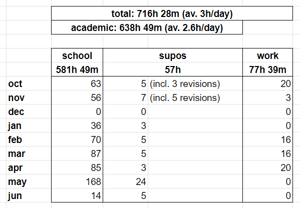
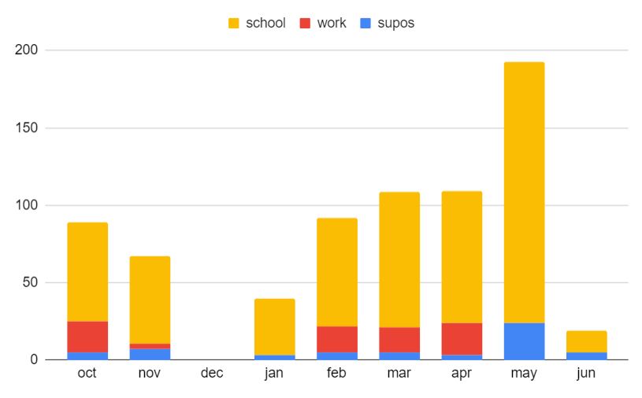

# Year 2 Content
[back](./README.md)

# 4-1 C++

**Code**  
Basic

1. Booleans  
2. References  
3. Typedef  
4. Const  
5. Enum  
6. Overloading  
7. Namespace

Basic OOP

8. Class  
   1. access control  
   2. member function  
   3. member variable  
9. Constructor  
   1. Const ref  
   2. Copy   
   3. Initialisation List  
10. Assignment Operator and overloading  
11. Heap and stack allocation of initialised objects  
12. Array heap deletion  
13. Friend class and friend method  
14. Static variable

Advanced Topics

15. Inheritance  
16. Virtual function  
17. Abstract class  
18. Multiple inheritance with name conflict  
19. Diamond problem (Keep Two Copies)  
20. Diamond problem \- Virtual Base Class (Keep One Copy)  
21. Exceptions:   
    1. passing in state / message,   
    2. throwing multiple levels  
    3. catching diff error classes  
    4. RAII \- resource acquisition is initialisation.  
22. Templates  
    1. Generics \- write a generic function.  
    2. Metaprogramming \- template specialisation. eg. prime

Misc

1. Tooling  
   1. ASan, MSan, UBSan, Valgrind  
2. GC and memory tracking  
   1. Recursive Freeing  
   2. Arenas  
   3. Ref count  
   4. Mark and Sweep  
3. Cache Optimisation  
   1. Arrays \> Pointers  
   2. Struct of arrays

# 4-2 CC

1. Grammar  
   1. Ambiguous  
   2. Left recursive, right recursive,   
2. Parsing: NULLABLE, FIRST, FOLLOW, LL(1), LR(0), SLR(1), SLR(1)  
3. CPS, defunctionalisation  
4. Translation, Stack machine operations (JARGON VM)  
5. Misc: GC, Optimisation, Linking / ELF, Bootstrapping

# 4-5 Cybersec

1. Unix file permissions \- display and commands, setuid, setgid

2. Buffer Overflow  
   1. How it works  
   2. Countermeasures (Stack canary, ASR, non-exec stack)  
   3. x86 function call convention (Push RA, then FP, then loc var \- RA is at ebp-4, 2 slots above your buffer limit)  
   4. Return-oriented programming / return to libc

3. SQL Injection  
   1. How it works  
   2. Countermeasures (Sanitisation, prepared statements)

4. Passwords  
   1. Salting and hashing  
   2. Lookup tables and rainbow tables  
   3. SSO system \- four categories

5. CSRF  
   1. HTTP Get and Post requests \- idempotence of GET  
   2. Countermeasures (referer header, SameSite cookie attr, Secret Token)  
   3. Other Cookie Attributes (Secure \- HTTPS, HttpOnly \- don't allow client scripts access)

6. XSS  
   1. Same-Origin Policy in JS.  
   2. Persistent vs Non-persistent XSS, exfiltration with \ tag  
   3. Countermeasures (Sanitisation, Content Security Policy)

7. Human Factors  
   1. Compliance Budget  
   2. Prospect theory.  
   3. Seven aspects of scam victims 

8. Malware  
   1. Types (virus, worm, trojan horse, spyware, adware, ransomware)  
   2. Quines

9. Physical Security  
   1. Lockpicking: c^s brute force vs s(s+1)/2 probing  
   2. Matt Blaze privilege escalation attack

# 5-1 CnDS

**Concurrent**

1. Primitives  
   1. Mutexes, Semaphores, Critical Regions  
   2. CAS, LLSC, Test and Set  
   3. **Example 1:** Ticket Locking (Bakery Algorithm)  
   4. **Example 2:** Producer-Consumer on a Circular Buffer  
   5. **Example 3:** MRSW First Iteration (using Semaphores)

2. Higher-Order Abstractions  
   1. CCRs, Monitors (Mesa and Hoare Semantics)  
   2. Active Objects, Actor Models (Message Passing: Message Queues)  
   3. Java (synchronised keyword: A variation on Monitors)  
   4. C++ (pthreads library: Mutexes and Condition Variables)  
   5. **Example 4:** MRSW Reprise (with the above abstractions),   
   6. **Example 5:** Producer-Consumer Reprise

3. Liveness  
   1. Conditions of Deadlock  
   2. Static Detection \+ Prevention; Dynamic \[Detection, Avoidance, Recovery\]  
      1. Banker's Algorithm  
   3. Priority Inversion

4. Transactions  
   1. ACID  
   2. Isolation models (Strict vs non-strict), serialisability  
   3. C \+ I  
      1. 2PL (strict and non-strict)  
      2. TSO  
      3. OCC  
   4. A \+ D  
      1. Write-ahead logging

5. Misc  
   1. Message Passing

**Distributed**

1. Models  
   1. Of System: Byzantine generals, two generals.   
   2. Of Links: Reliable, eventually, arbitrary  
   3. Of Nodes: Crash-stop, crash-recovery, byzantine.  
   4. Of Timings: Synchronous, Partially synchronous, Asynchronous

2. Physical Time  
   1. NTP  
   2. Monotonic clocks  
   3. Happens-before relation

3. Logical Time \+ Broadcast Protocols  
   1. Lamport Clock  
   2. Vector Clock  
   3. Broadcast Models (FIFO, Causal-order, Total-order)  
   4. Broadcast Protocols  
      1. Reliable Broadcast (Gossip, all repeat, just go)  
      2. FIFO Broadcast (individual counter)  
      3. Causal Broadcast (Vector clocks)  
      4. Total Order Broadcast (leader election)

4. Replication  
   1. Idempotent, problems  
   2. Quorum, read repair  
   3. With Total order broadcast

5. Consensus \- Raft  
   1. Election  
   2. Sending  
   3. Receiving

6. Consistency  
   1. Various models of consistency  
   2. Atomic commit (model) \- 2PC (implementation)  
   3. Linearizability (model) \- ABD algo (Quorum w read repair) (implementation)  
   4. Eventual consistency, CAP

7. ***Applications***  
   1. ***CRDTs \[to-do\]***  
   2. ***True time, Google Spanner***

# 

# 5-2 CA

**1 Introduction**

1. Moore's Law  
2. Parts of a Chip Design Process & Diagram  
3. The Eight Great Ideas of Computer Design

**2 RISC-V**

1. Motivation  
2. ISA \+ common instr  
3. ***Sign-extending \[to do\]***  
4. Calling Convention

**3 Pipelining**

1. Load \-\> Use Data Hazard  
2. Execute \-\> Execute Data Hazard  
3. Control Hazard

**4 Memory**

1. Three types of cache design & how they work  
2. Advantages and disadvantages  
3. Miss policies and write policies 

**5 OS**

1. Page table structure on the RISC-V \+ translation  
2. How System Calls work

**6 SOC: Intro**

1. Flynn's Taxonomy  
2. Amdahl's and Gustavon's Law  
3. ***DRAM structure \[to-do\]***

**7 Multicore**

1. Cache Coherence  
2. Reordering memory ops \- memory barrier  
3. The Two Atomic Operations and how to implement locks with them

**8 GPU**

1. Branching using masking and predication  
2. Warps and warp scheduler

**9 [SystemVerilog](https://www.cl.cam.ac.uk/teaching/exams/solutions/2019/2019-p05-q01-solutions.pdf)**

1. 3 types of assignment  
2. Ternary vs if-then-else  
3. Three-valued logic (0, 1, x, z)  
4. Synchronous vs asynchronous reset

# 5-3 CN

1. **Introduction**  
   1. Circuit Switching: (FDM, TDM,)  vs Packet Switching

2. **Architecture**  
   1. 7 Layer Model  
   2. End to end principle  
   3. Benefits / Drawbacks of Layering

3. **Physical**  
   1. Shannon–Hartley theorem (Capacity to SNR)  
   2. Bit Rate vs Baud Rate  
   3. CDMA (Code-Division Multiple Access), TDMA, FDMA  
   4. Line Codes (NRZ, NRZM, NRZI, Manchester)  
   5. Scrambling (XORing)  
   6. Forward error detection and correction (Parity, CRC, detection)

4. **Link layer**  
   1. 3 types of Protocols (Channel partition, taking turns, RA)  
   2. Channel Partition: (TDMA, ATM, FDMA, CDMA)  
   3. Taking Turns (Polling, Token Ring)  
   4. CSMA/CD  
      1. Efficiency equation (trans / trans \+ dist\*k)  
      2. Minimum packet size, max dist  
      3. Binary exponential backoff.  
   5. CSMA/CA  
      1. Exposed and hidden terminals  
      2. RTS/CTS  
   6. Where to send? \= Spanning Tree Protocol

5. **Network layer**  
   1. Structure of the Internet (ASes)  
   2. Structure of a Router  
      1. Data and control plane  
      2. Components (Input queue, output queue, switching fabric, processor)  
      3. Input port queuing: HOL blocking  
      4. Output port queuing \- who gets dropped, who to schedule.  
      5. Queueing policies (FCFS, round robin, weighted fair queuing)  
   3. Where to send (Routing Protocols)  
      1. Link state routing  
      2. Distance vector routing  
   4. IP  
      1. IP Packet (Lengths, frag, TTL, protocol, checksum)  
      2. IP address, subnets  
      3. DHCP: DORA  
      4. NAT (Traversal problem, is-a layer violation, is-a firewall)  
      5. ARP (Broadcasting, Caching, Soft-state)  
      6. Traceroute, ICMP   
      7. IPv6, SLAAC, happy eyeballs  
6. **Transport layer**  
   1. Transport Protocols (demux, ports), UDP  
   2. Prelude to Congestion (Causes and effects of Congestion, Models)  
   3. Prelude to Reliability  
      1. rdt2.0 (ACK/NAK), rdt2.1 (seq n.), 2.2 (no nak), 3.0 (timeout), ARQ GBN, SACK  
      2. Karn-Partridge: Defining a good timeout (EMA)  
   4. Min-max fairness  
   5. TCP   
      1. Setup (3 way handshake)  
      2. Transmit (Window size, acks, timeouts)  
      3. Teardown (3 / 4 way handshake)  
      4. Flow control (advertised window)  
      5. Congestion control (CWND \+ the state machine with 3 states)  
   6. Buffer Sizing Story

7. **Applications**  
   1. DNS  
      1. Recursive / Iterative query procedure, hierarchy  
      2. DNS Records, Type and Structure  
      3. DNSSEC  
   2. HTTP  
      1. GET/POST/ etc...  
      2. Cookies  
   3. Peer to peer  
      1. pirate stuff

# 6-1 DS

1. Specifying Probability Models  
2. Linear Models  
   1. Linear Independence  
3. Bayesian Inference  
4. Frequentist Inference  
5. HMM

# 6-2 Sem

1. Rule induction, structural induction.  
   1. Progress theorem, determinacy proofs  
2. L1, L2, L3 (moving forward)  
3. Typing \+ Type inference \+ Type judgement  
4. Subtyping  
5. Concurrency.  
6. Semantics for the while loop

# 6-3 LnP

1. Sequent Calculus (Basic, connectives, cut, exists/forall...)  
2. DPLL  
3. First-order resolution  
   1. Unification  
   2. Skolemisation  
   3. Herbrand Interpretations  
   4. Resolution  
   5. Factoring  
4. SMTs  
5. BDD  
6. S4 Modal Logic (Sequent for square/diamond)  
7. Tableau Calculus \+ Free Variable Tableaux

# 6-4 CT

1. Register Machine \[ok\]  
   1. Definition  
   2. Coding (Pairs, lists, programs)  
   3. RM-computable  
   4. URM  
2. Halting Problem \[ok\]  
   1. Undecidable sets  
3. Turing Machine \[ok\]  
   1. Definition  
   2. TM-computable  
   3. TM \-\> RM, RM \-\> TM

4. Partial Functions  
   1. Definition (Basic \- CSP, Ops \- CPM)  
   2. Aackerman  
   3. Reduction to RM

5. Lambda  
   1. Definition  
      1. Syntax (3 rules)  
      2. Free and bound variable (3 \+ 3\)  
      3. Alpha-equivalence (3)  
      4. Capture-avoiding substitution (4)  
      5. One-step beta (5)  
      6. Many-step beta (3)  
      7. Beta conversion (6)  
   2. Reductions  
      1. Church-Rosser Theorem  
      2. Normal-order Beta Reduction  
      3. Fixed-point Combinator  
   3. Computation  
      1. Reduction to RM  
      2. Church encoding  
      3. Representing PR functions in Lambda

# 6-5 CX

1. Definition of TM, NDTM  
2. Definition of complexity classes (space and time) \- L, NL, P, NP, PSPACE, NPSPACE, EXP.  
3. ~~Cook-Levin Theorem~~  
4. Reductions: Everything below  
   1. CNF-SAT to 3SAT  
   2. ~~3SAT to 3COL~~  
   3. 3SAT To IND  
   4. IND to CLIQUE (Trivial)  
   5. HAM to TSP  
   6. ~~3SAT to 3DM~~  
   7. 3DM to Exact Cover by 3 Sets (Trivial)  
   8. Exact Cover by 3 Sets to Set Covering (Trivial)  
   9. ~~Exact Cover by 3 Sets to Knapsack~~  
   10. Knapsack to Subset Sum  
5. coNP, Factor and Prime  
6. Cryptography (FNP, One-way Functions)  
7. Space stuff   
   1. ~~Constructable functions~~  
   2. 3 x REACHABILITY is in TIME(n^2), ~~NL~~ and SPACE(log(n)^2)  
   3. Five inclusions  
   4. ~~Hierarchy Theorems~~  
8. Quantum / BQP  
   1. Definition of BQP  
   2. \> \< Theorem  
   3. ~~4 postulates of QM~~  
   4. ~~Grovers's search, QFT~~

# 7-2 ELE

**Econs**

1. General Economics  
   1. Supply, Demand, Price elasticity of demand, etc.   
   2. Monopolist actions: price discrimination  
   3. Market Failure: externalities, imperfect information, etc.  
   4. Welfare Economics: Pareto efficiency, \<-\> equilibrium markets, diff types of welfare  
2. Information Economics  
3. Auction and game theory  
   1. Auctions  
      1. 5 types of auctions  
      2. Strategic vs revenue equivalence  
      3. Private value vs public value  
      4. Google Ad Auctions  
   2. Game Theory  
      1. Pure strategy NE (eg. BOTS)  
      2. Mixed strategy NE (eg. Tennis)  
      3. Prisoner's Dilemma  
      4. Stag Hunt  
      5. Chicken  
      6. Hawk-dove  
   3. Modelling consumer behaviour: satisficing, etc.

**Law**

4. Types of law, criminal, contract, tort  
5. Criminal: Computer Misuse Act, GDPR  
6. Contract: invitation to treat, terms n conditions,

**Ethics**

7. Deontology and Utilitarianism  
8. Modern Ethical considerations

# 7-3 HCI

1. Three waves  
2. Elements of Visual Design (MSRS)  
3. Goal-oriented interaction  
   1. Assumptions abt human behaviour  
   2. Wicked problems 10 char  
4. Efficient  
   1. KLM  
   2. Fitt's Law  
   3. Case Study: Google SEarch  
5. Smart  
   1. Information Theory  
   2. Case Study: Dasher Project  
   3. Case Study: Information Efficient IDEs  
6. Meaningful  
   1. Design Ethnography  
   2. Case Study: My ICU Voice  
7. Evaluation 1  
   1. Types (qual/quan, empirical/analytical, formative/summative)  
   2. A/B Test \+ Hyp test  
   3. Interviews, Think Aloud  
   4. Open coding  
   5. Closed coding  
8. Evaluation 2  
   1. CDNs

# 7-4 AI

Algorithms

1. **Heuristic** A\*, IDA\*, Best-first search  
2. **Local** (hill-climbing search, gradient ascent)  
3. **Games** Minimax w ab pruning  
4. **CSPs** Forward check, AC3, Gaschnig, Backjumping

Knowledge and Planning

5. Situation Calculus (KR)  
   1. Frame axioms  
   2. Successor-state axioms  
6. Partial order planning algorithm  
7. Graphplan w heuristics  
8. Encoding in Prop logic  
9. Encoding as CSP: State-variable representation  
10. Neural networks, backprop algorithm

# 7-5 FML

1. Chomsky Classes  
   1. Pumping (Reg / CFG)  
   2. Closure under intersection / union  
   3. Centre embeddings  
   4. Long range dependency  
   5. Cross-serial dependency  
2. Grammar models  
   1. Regular  
   2. Context-free  
   3. Tree-adjoining  
   4. Dependency  
   5. Categorial (under learning)  
3. Earley Parser  
4. Learning  
   1. Byte-pair Encoding  
   2. Grammatical System  
   3. Components of a Learning Paradigm  
   4. Gold's Theorem  
5. Info Theory  
   1. Entropy  
   2. Mutual Information  
   3. Conditional Entropy  
   4. Joint Entropy  
   5. Entropy Rate  
   6. Noisy Channel  
6. Vectors  
   1. Window count model   
   2. Dimensionality Reduction (Single Value Decomposition)  
   3. word2vec  
      1. BOW  
      2. Skip-gram  
7. Human Factors  
   1. Yngve: Stack depth  
   2. Hale: surprisal  
   3. Constant info rate

# Year 2 Workload Summary
- `school` is anything academic-related that is not a supervision (watching/going for lectures, doing supervision work, general studying/revision)
- `supos` is time spent in supervision (each supo is 1h long)
- `work` is non-academic CS-related work (personal projects / etc.)

